 README - MobAuditFlow

Plateforme d’Audit Automatisé Mobile basée sur OWASP MASVS / MASTG et Intelligence Artificielle
===============================================================================================

MobAuditFlow
------------

* * *

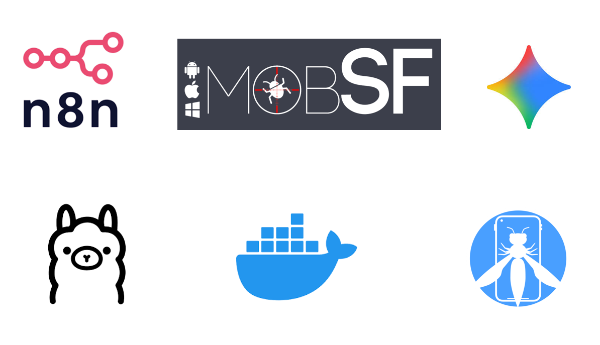

* * *

1\. Présentation Générale du Projet
-----------------------------------

MobAuditFlow est une plateforme intelligente d’automatisation des audits de sécurité des applications mobiles Android.

La plateforme combine plusieurs technologies modernes afin de transformer des résultats techniques bruts en rapports de sécurité contextualisés et exploitables.

Le système repose principalement sur :

*   OWASP MASVS ;
*   OWASP MASTG ;
*   MobSF ;
*   n8n ;
*   Ollama ;
*   Gemini API ;
*   ChromaDB ;
*   Docker ;
*   Gotenberg.

L’objectif principal du projet est d’automatiser les tâches répétitives des audits de sécurité mobile.

La plateforme agit comme un pipeline intelligent capable de :

*   Analyser des APK Android ;
*   Interpréter les résultats MobSF ;
*   Effectuer un mapping MASVS ;
*   Générer automatiquement des recommandations ;
*   Produire des rapports PDF professionnels ;
*   Envoyer automatiquement les rapports.

* * *

2\. Contexte du Projet
----------------------

Les audits de sécurité mobiles sont généralement longs et complexes.

Les auditeurs doivent analyser manuellement :

*   Le manifest Android ;
*   Les permissions ;
*   Les endpoints réseau ;
*   Les certificats ;
*   Le code Java/Kotlin ;
*   Les bibliothèques natives ;
*   Les mécanismes anti-debug ;
*   Les systèmes anti-root ;
*   Les configurations de sécurité.

Cette charge de travail est souvent répétitive et chronophage.

MobAuditFlow a été conçu afin de réduire cette charge grâce à :

*   L’automatisation ;
*   L’intelligence artificielle ;
*   Le RAG ;
*   Les workflows low-code ;
*   L’orchestration distribuée.

* * *

3\. Objectifs du Projet
-----------------------

### 3.1 Objectifs Fonctionnels

*   Réception automatique des fichiers JSON MobSF ;
*   Analyse automatique des findings ;
*   Classification MASVS ;
*   Réduction des faux positifs ;
*   Génération des recommandations ;
*   Génération automatique des rapports ;
*   Envoi automatique par email.

### 3.2 Objectifs Techniques

*   Architecture distribuée ;
*   Pipeline IA multi-agents ;
*   IA locale via Ollama ;
*   Architecture RAG ;
*   Scalabilité ;
*   Isolation Docker ;
*   Automatisation complète.

* * *

4\. Architecture Générale
-------------------------

L’architecture suit un modèle modulaire.

Chaque composant possède une responsabilité spécifique.

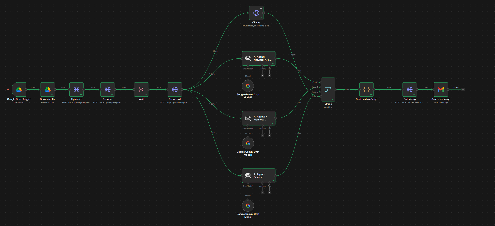

Figure 1 — Architecture générale de la plateforme MobAuditFlow.

* * *

5\. Description des Composants
------------------------------

Composant

Description

MobSF

Analyse statique et dynamique des APK Android.

n8n

Orchestration complète des workflows.

Ollama

Exécution locale des modèles IA.

Gemini API

Analyse IA distante.

ChromaDB

Base vectorielle utilisée pour le RAG.

Docker

Conteneurisation des services.

Gotenberg

Conversion HTML vers PDF.

Google Drive

Point d’entrée des analyses.

* * *

6\. Workflow Global du Système
------------------------------

APK Upload
↓
MobSF Analysis
↓
JSON Export
↓
Google Drive Trigger
↓
n8n Workflow
↓
JavaScript Parsing
↓
AI Multi-Agents
↓
RAG MASVS Lookup
↓
Merge Results
↓
HTML Report
↓
PDF Conversion
↓
Email Delivery

* * *

7\. Workflow Principal n8n
--------------------------

Le workflow n8n constitue le cerveau opérationnel de la plateforme.

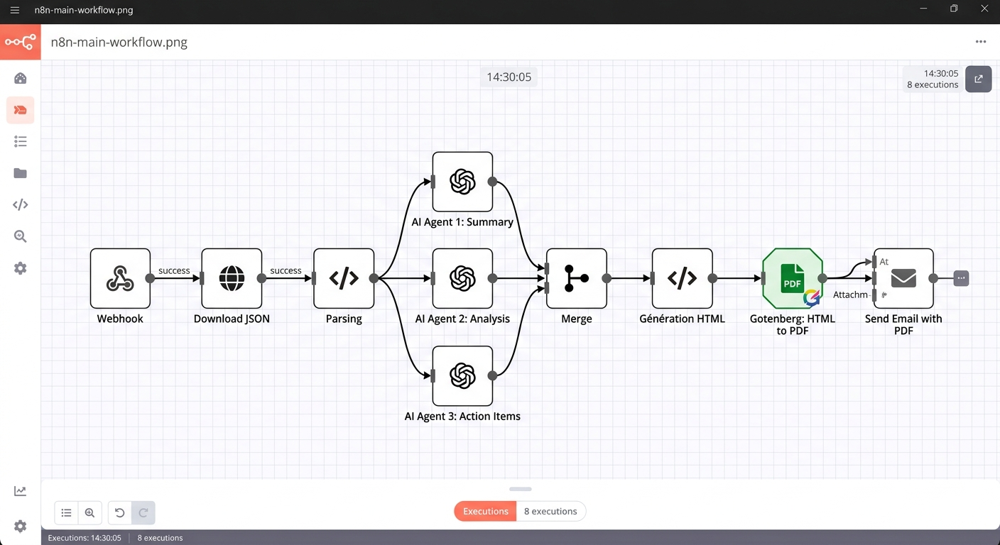

Figure 2 — Workflow principal n8n.

* * *

8\. Déclenchement Automatique via Google Drive
----------------------------------------------

Le workflow démarre automatiquement lorsqu’un nouveau fichier JSON MobSF est détecté.

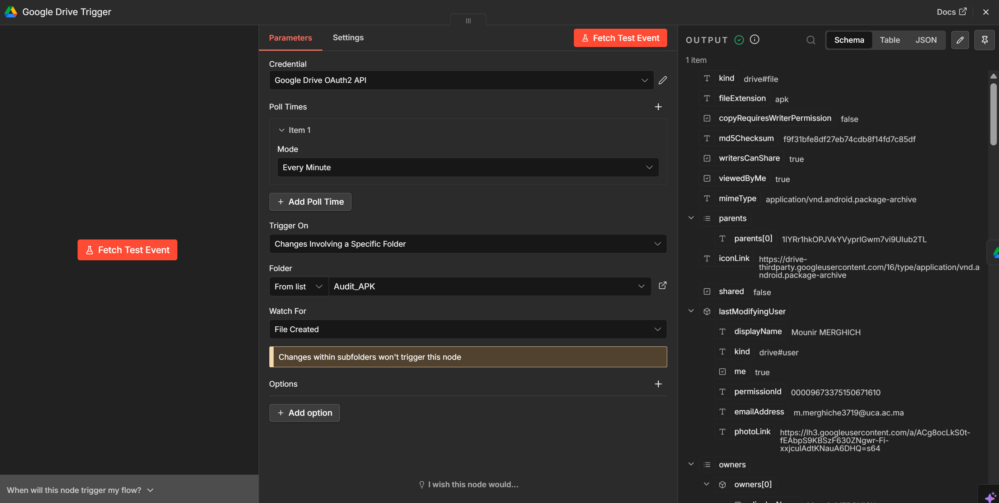

Figure 3 — Déclencheur Google Drive.

* * *

9\. Parsing et Nettoyage des Données
------------------------------------

Un nœud JavaScript spécialisé permet :

*   La suppression des doublons ;
*   Le filtrage des findings ;
*   La réduction du bruit ;
*   La normalisation JSON ;
*   La préparation des prompts IA.

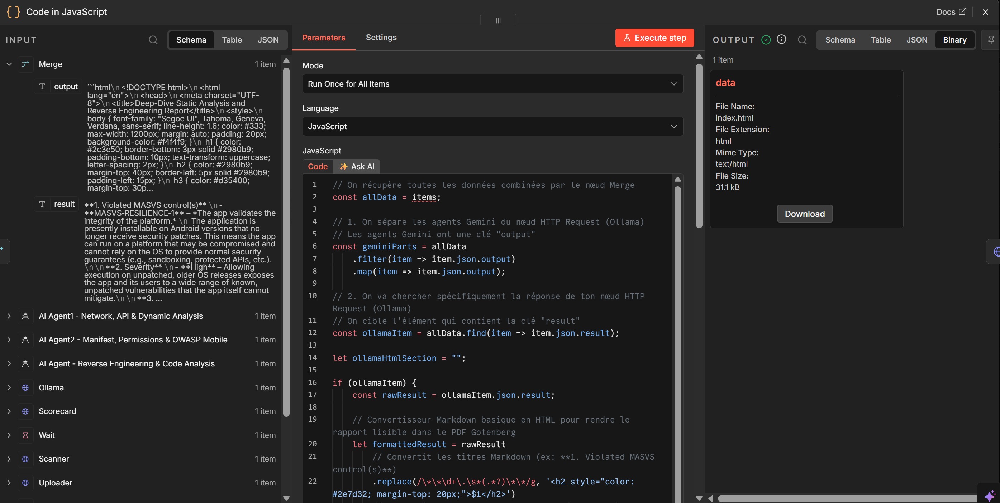

Figure 4 — Nœud JavaScript de parsing.

* * *

10\. Architecture Multi-Agents IA
---------------------------------

La plateforme utilise plusieurs agents IA spécialisés.

Agent

Responsabilité

Manifest Agent

Analyse AndroidManifest.xml.

API Agent

Analyse réseau et endpoints.

Reverse Agent

Analyse reverse engineering.

MASVS Agent

Classification MASVS.

Ollama Agent

Analyse locale.

* * *

11\. Agent Gemini
-----------------

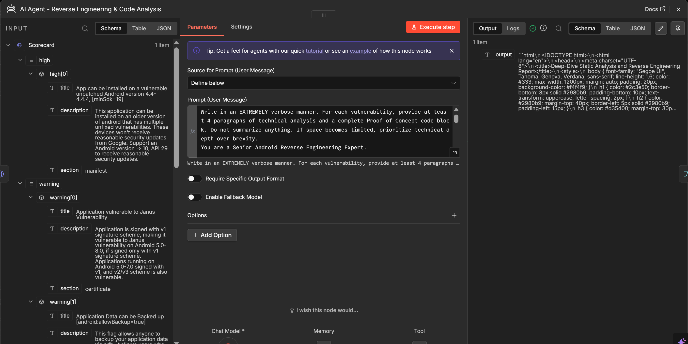

Figure 5 — Agent Gemini utilisé pour l’analyse contextuelle.

* * *

12\. Agent Ollama Local
-----------------------

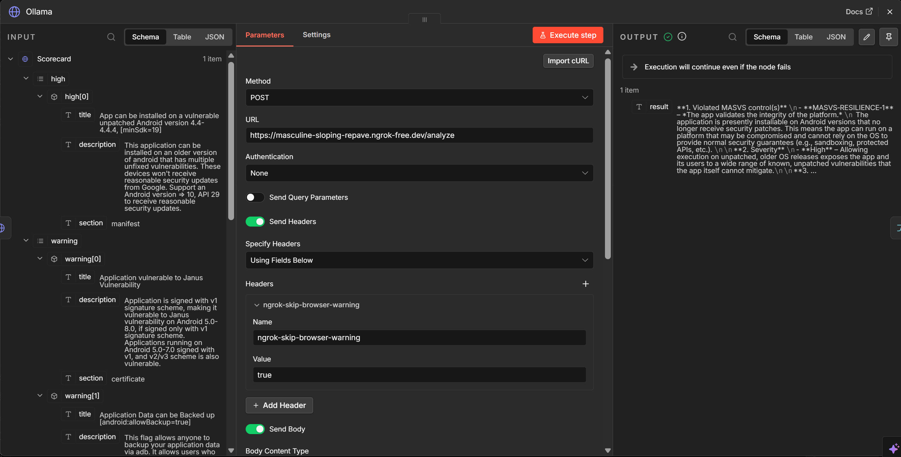

Figure 6 — Nœud Ollama local.

* * *

13\. Synchronisation des Agents
-------------------------------

Les réponses des agents IA sont synchronisées via un nœud Merge.

Configuration critique :

Wait for all inputs to arrive

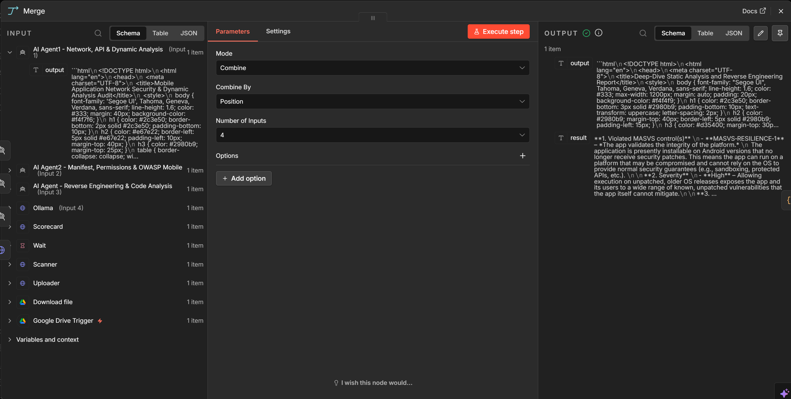

Figure 7 — Nœud Merge de synchronisation.

* * *

14\. Architecture RAG
---------------------

Le système utilise une architecture Retrieval-Augmented Generation.

Les documents OWASP sont indexés dans ChromaDB.

### 14.1 Pipeline RAG

*   Téléchargement des documents ;
*   Découpage des chunks ;
*   Création des embeddings ;
*   Stockage vectoriel ;
*   Recherche par similarité ;
*   Injection dans les prompts.

### 14.2 Embeddings Utilisés

nomic-embed-text
mxbai-embed-large

* * *

15\. Réponse IA Enrichie
------------------------

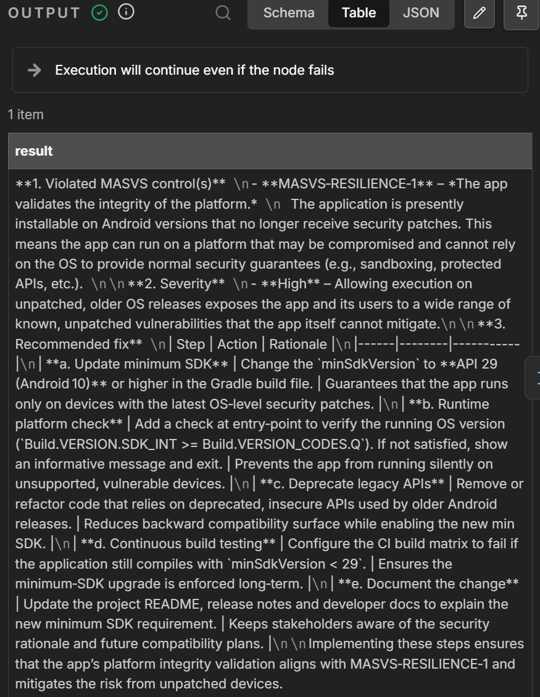

Figure 8 — Réponse IA enrichie avec références MASVS.

* * *

16\. Réduction des Faux Positifs
--------------------------------

MobSF génère souvent des findings non pertinents.

L’IA aide à :

*   Corréler les findings ;
*   Éliminer les doublons ;
*   Réduire les faux positifs ;
*   Prioriser les risques.

* * *

17\. Système de Scoring
-----------------------

Critère

Poids

Criticité MobSF

40%

Impact métier

25%

Exploitabilité

20%

Mapping MASVS

15%

* * *

18\. Dockerisation
------------------

L’ensemble des composants est conteneurisé.

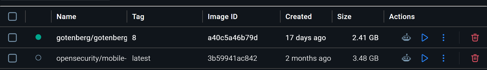

Figure 9 — Conteneurs Docker actifs.

* * *

19\. Exemple Docker Compose
---------------------------

version: '3'

services:

  n8n:
    image: n8nio/n8n

  ollama:
    image: ollama/ollama

  chromadb:
    image: chromadb/chroma

  gotenberg:
    image: gotenberg/gotenberg

* * *

20\. Analyse MobSF
------------------

MobSF constitue le moteur principal d’analyse statique.

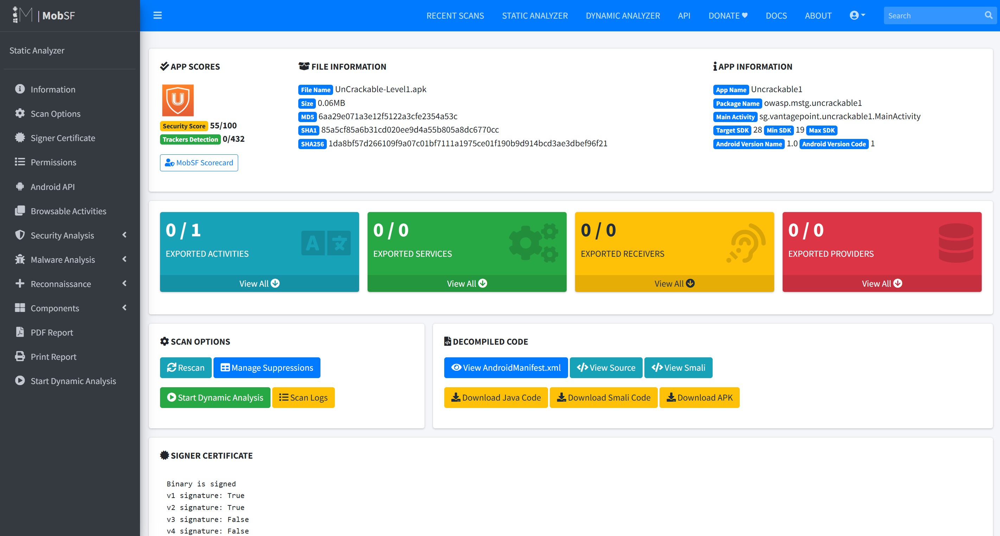

Figure 10 — Dashboard MobSF.

* * *

21\. Vulnérabilités Détectées
-----------------------------

*   Hardcoded Secrets ;
*   Weak Cryptography ;
*   Root Detection ;
*   Debug Detection ;
*   Certificate Validation Issues ;
*   Insecure Storage ;
*   Cleartext Traffic ;
*   Reverse Engineering Exposure.

* * *

22\. Réponses JSON
------------------

Les résultats MobSF sont traités sous forme JSON.

{
  "title": "Hardcoded API Key",
  "severity": "high",
  "masvs": "MASVS-STORAGE-1"
}

* * *

23\. Génération Automatique des Rapports
----------------------------------------

Le système génère automatiquement des rapports HTML puis PDF.

### 23.1 Couverture du Rapport

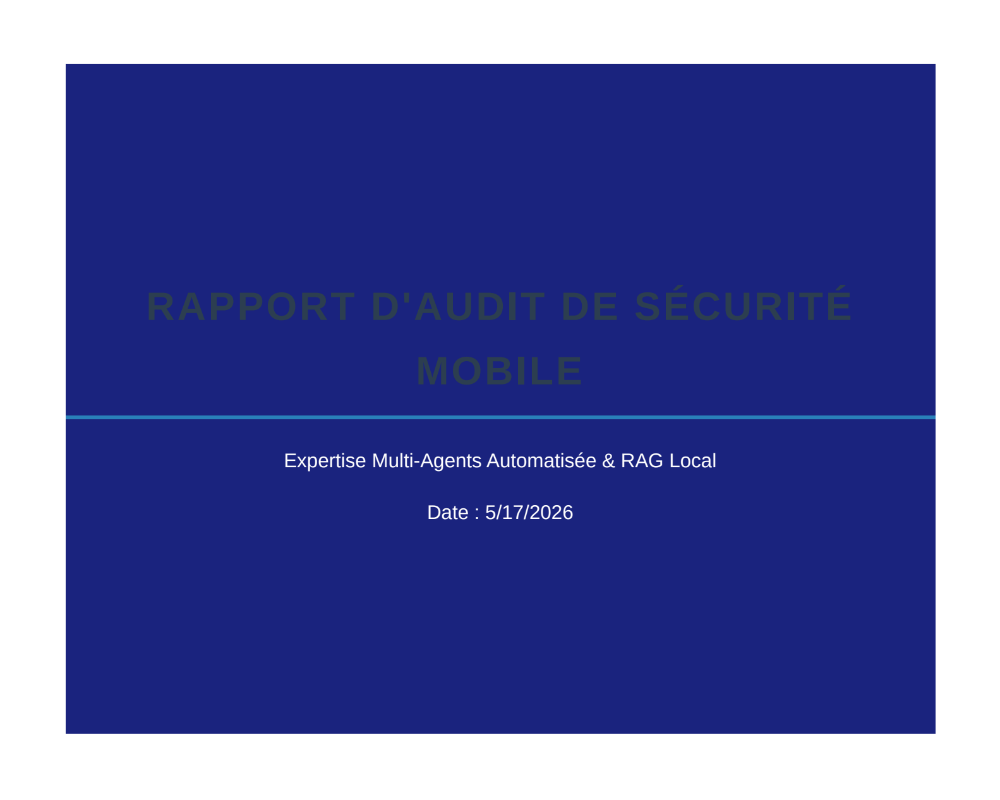

Figure 11 — Couverture du rapport.

### 23.2 Executive Summary

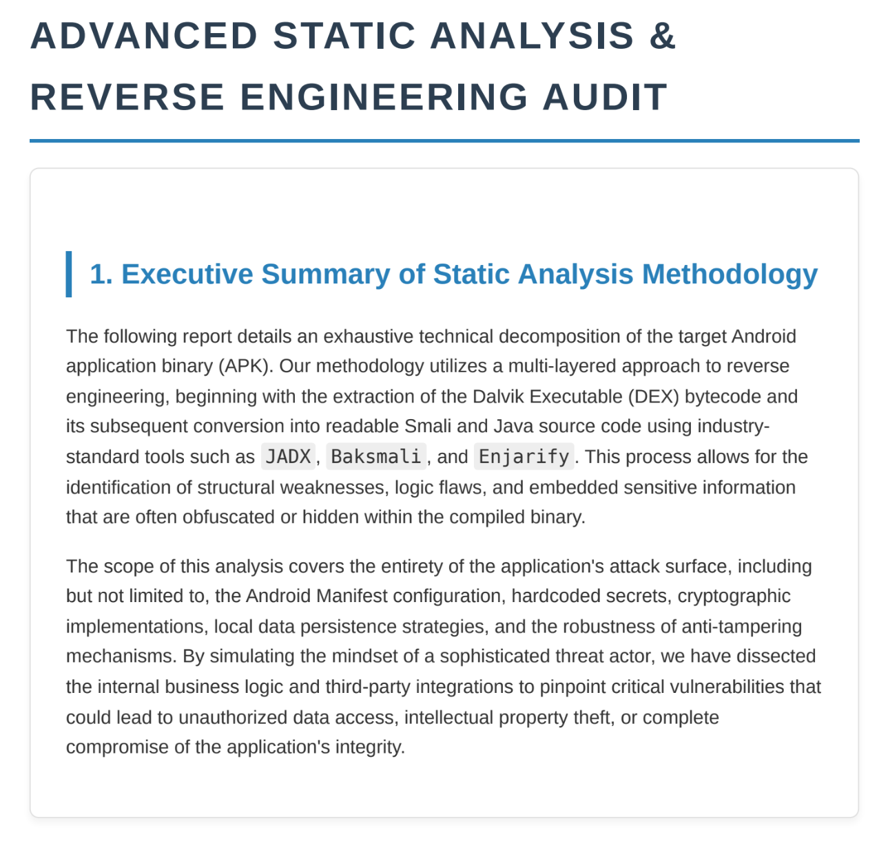

Figure 12 — Résumé exécutif.

### 23.3 Détails des Vulnérabilités

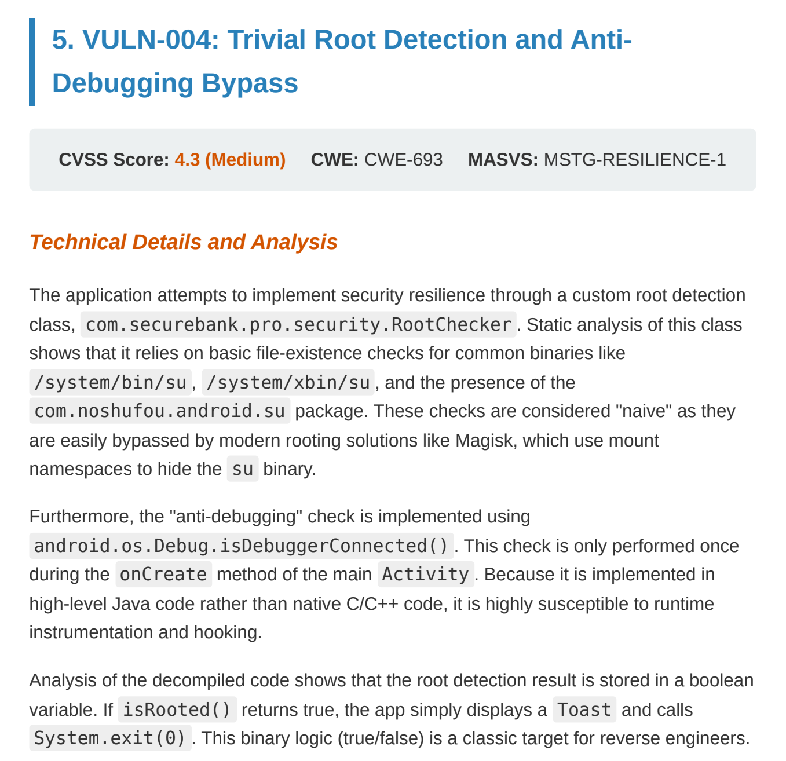

Figure 13 — Détails des vulnérabilités.

* * *

24\. Envoi Automatique des Emails
---------------------------------

Le rapport final est automatiquement envoyé par email.

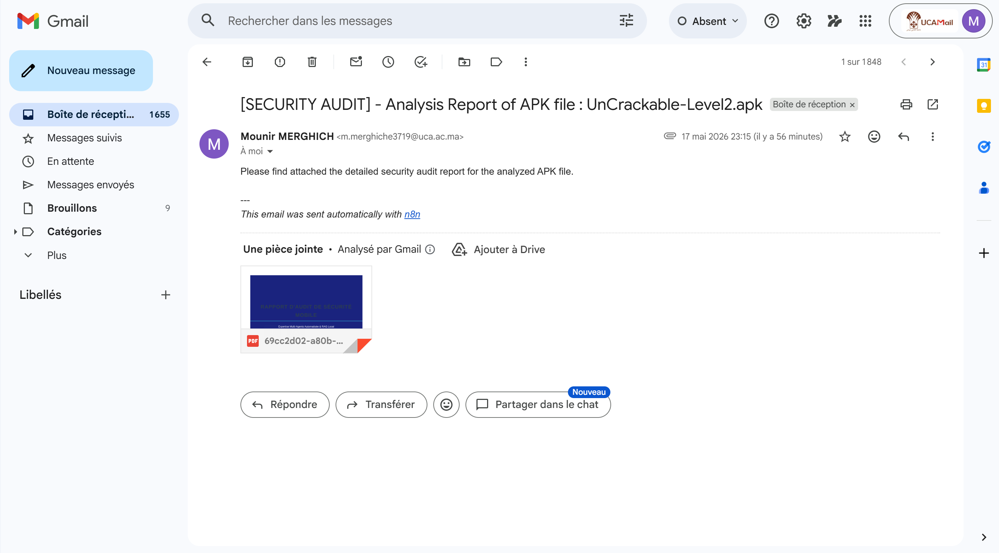

Figure 14 — Email automatique contenant le rapport PDF.

* * *

25\. Cas d’Étude : OWASP UnCrackable-Level2
-------------------------------------------

Plusieurs APK vulnérables ont été utilisés.

Le principal APK testé est :

OWASP UnCrackable-Level2

### 25.1 Vulnérabilités Observées

*   Root Detection ;
*   Debug Detection ;
*   Hardcoded Secrets ;
*   Weak Cryptography ;
*   Anti-Tampering ;
*   Reverse Engineering Exposure.

* * *

26\. Reverse Engineering
------------------------

Le reverse engineering est effectué via JADX.

Les analyses permettent :

*   L’extraction du code ;
*   L’analyse des secrets ;
*   L’identification des protections ;
*   L’étude des mécanismes anti-debug.

* * *

27\. Méthodologie de Développement
----------------------------------

Le projet suit une approche modulaire et incrémentale.

*   Architecture orientée services ;
*   Automatisation progressive ;
*   Tests continus ;
*   Validation incrémentale ;
*   Développement collaboratif.

* * *

28\. Organisation des Dossiers
------------------------------

/project
│
├── docs/
├── screenshots/
├── workflows/
├── reports/
├── rag/
├── prompts/
├── docker/
├── parsers/
├── scripts/
└── outputs/

* * *

29\. Gestion des Prompts IA
---------------------------

Les prompts sont contextualisés avec :

*   Les findings MobSF ;
*   Le contexte MASVS ;
*   Les documents RAG ;
*   Les recommandations OWASP.

Analyze the following Android vulnerability
and map it to OWASP MASVS controls.

* * *

30\. Analyse des Performances
-----------------------------

Étape

Temps Moyen

MobSF Scan

2 min

IA Analysis

30 sec

PDF Generation

10 sec

Email Delivery

5 sec

* * *

31\. Comparaison Avant / Après Automatisation
---------------------------------------------

Processus

Manuel

Automatisé

Mapping MASVS

30 min

10 sec

Rapport PDF

1h

20 sec

Analyse Findings

45 min

15 sec

* * *

32\. Sécurité de la Plateforme
------------------------------

*   Isolation Docker ;
*   IA locale ;
*   Réduction dépendance cloud ;
*   Confidentialité des analyses ;
*   Segmentation des services.

* * *

33\. Difficultés Rencontrées
----------------------------

*   Synchronisation IA ;
*   Quotas Gemini ;
*   Consommation RAM ;
*   Faux positifs MobSF ;
*   Complexité MASVS ;
*   Normalisation JSON.

* * *

34\. Perspectives Futures
-------------------------

*   Support iOS ;
*   Burp Suite ;
*   Dashboard temps réel ;
*   CI/CD Security ;
*   Scoring CVSS ;
*   Support multi-utilisateurs ;
*   SIEM Integration.

* * *

35\. Pipeline CI/CD Futur
-------------------------

GitHub Actions
↓
APK Build
↓
MobAuditFlow
↓
Security Analysis
↓
PDF Report
↓
Deployment Validation

* * *

36\. Glossaire
--------------

Terme

Définition

RAG

Retrieval-Augmented Generation

MASVS

Mobile Application Security Verification Standard

APK

Android Package

SAST

Static Application Security Testing

* * *

37\. Répartition des Tâches
---------------------------

Membre

Responsabilités

P1

Analyse APK et MobSF

P2

RAG et IA

P3

n8n et orchestration

P4

QA et reporting

* * *

38\. Technologies Utilisées
---------------------------

*   n8n ;
*   MobSF ;
*   Ollama ;
*   Gemini API ;
*   Docker ;
*   ChromaDB ;
*   JavaScript ;
*   Node.js ;
*   Google Drive API ;
*   Gotenberg.

* * *

39\. Références
---------------

*   OWASP MASVS ;
*   OWASP MASTG ;
*   MobSF Documentation ;
*   n8n Documentation ;
*   Ollama Documentation ;
*   Docker Documentation ;
*   ChromaDB Documentation.

* * *

40\. Conclusion
---------------

MobAuditFlow démontre qu’il est possible d’autatiser une grande partie des audits de sécurité mobiles grâce à l’intelligence artificielle et l’orchestration low-code.

La plateforme permet :

*   La standardisation des audits ;
*   La réduction du temps humain ;
*   L’amélioration de la contextualisation ;
*   La génération automatique de rapports ;
*   L’intégration future dans des pipelines DevSecOps.

Le projet constitue une base solide pour le développement futur de plateformes avancées de cybersécurité assistées par IA.

* * *
## 17. Démonstration Vidéo de la Plateforme

Cette démonstration vidéo présente le fonctionnement global de la plateforme intelligente **MobAuditFlow**.

La vidéo illustre les différentes étapes du pipeline :

- Détection automatique des scans MobSF ;
- Déclenchement automatique du workflow n8n ;
- Parsing et nettoyage des données JSON ;
- Analyse multi-agents IA ;
- Mapping OWASP MASVS ;
- Génération automatique des rapports ;
- Envoi automatique par email ;
- Analyse d’exemple sur OWASP UnCrackable-Level1.

---

<video width="100%" controls poster="docs/screenshots/overview-banner.png">
    <source src="docs/demo/demo.mp4" type="video/mp4">
    Votre navigateur ne supporte pas les vidéos HTML5.
</video>

---

### Emplacement du fichier vidéo

```text
docs/
└── demo/
    └── demo.mp4
```

### Note

Si la vidéo ne s’affiche pas correctement sur GitHub, il est recommandé d’ouvrir directement le fichier `README.html` dans un navigateur web local.

Projet académique réalisé dans le cadre d’un système intelligent d’automatisation des audits de sécurité mobile.
